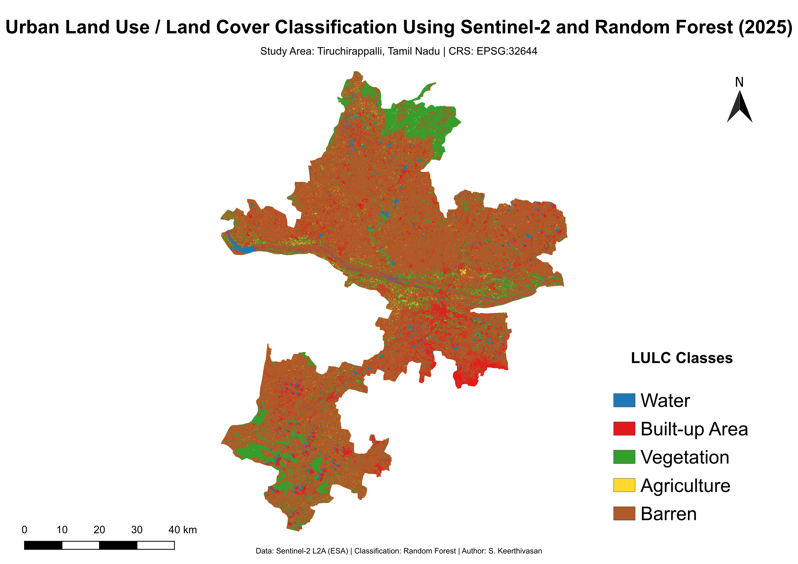

# Urban Land Use / Land Cover Classification using Sentinel-2 and Random Forest

## 📌 Project Overview
This project demonstrates an end-to-end **urban Land Use / Land Cover (LULC) classification workflow**
using **Sentinel-2 multispectral imagery** and a **Random Forest machine learning classifier**.

The objective is to map major urban land cover classes by integrating:
- GIS-based preprocessing (QGIS)
- Pixel-level feature extraction
- Supervised machine learning in Python

---

## 🗺️ Study Area
**Tiruchirappalli (Trichy), Tamil Nadu, India**  
Coordinate Reference System (CRS): **EPSG:32644 (WGS 84 / UTM Zone 44N)**

---

## 📊 Final LULC Map

---

## 🛰️ Data Used

- **Satellite:** Sentinel-2 Level-2A (ESA)
- **Acquisition Date:** March 13, 2025
- **Spatial Resolution:** 10 m
- **Spectral Bands Used:**
  - B02 (Blue)
  - B03 (Green)
  - B04 (Red)
  - B08 (Near Infrared)

> Note: Raw Sentinel-2 data is not included in this repository due to file size limitations.

